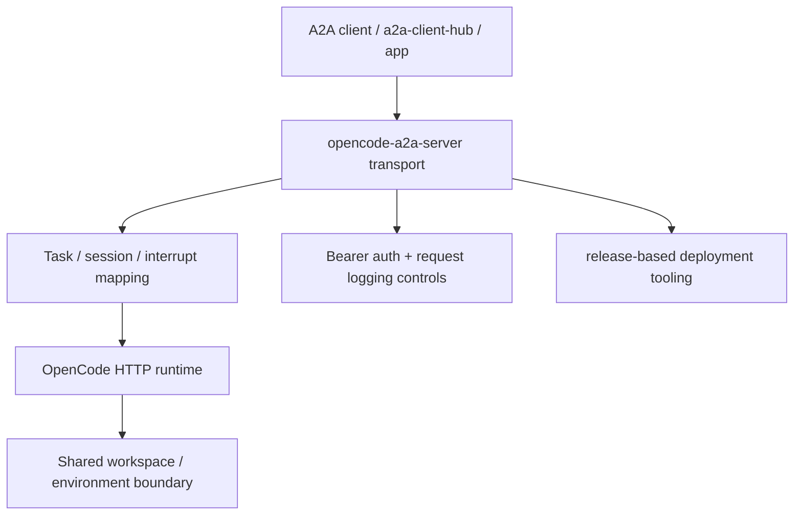

# opencode-a2a-server

> Turn OpenCode into a stateful A2A service with a clear runtime boundary and production-friendly deployment workflow.

`opencode-a2a-server` exposes OpenCode through standard A2A interfaces and adds
the operational pieces that raw agent runtimes usually do not provide by
default: authentication, session continuity, streaming contracts, interrupt
handling, deployment tooling, and explicit security guidance.

## Why This Project Exists

OpenCode is useful as an interactive runtime, but applications and gateways
need a stable service layer around it. This repository provides that layer by:

- bridging A2A transport contracts to OpenCode session/message/event APIs
- making session and interrupt behavior explicit and auditable
- packaging release-first deployment scripts and operational guidance for long-running use

## What It Already Provides

- A2A HTTP+JSON endpoints (`/v1/message:send`, `/v1/message:stream`,
  `GET /v1/tasks/{task_id}:subscribe`)
- A2A JSON-RPC endpoint (`POST /`) for standard methods and OpenCode-oriented
  extensions
- SSE streaming with normalized `text`, `reasoning`, and `tool_call` blocks
- session continuation via `metadata.shared.session.id`
- request-scoped model selection via `metadata.shared.model`
- OpenCode session query/control extensions and provider/model discovery
- released CLI install/upgrade flow and release-based systemd deployment

## Extension Capability Overview

The Agent Card declares six extension URIs. Shared contracts are intended for
any compatible consumer; OpenCode-specific contracts stay provider-scoped even
though they are exposed through A2A JSON-RPC.

| Extension URI | Scope | Primary use |
| --- | --- | --- |
| `urn:a2a:session-binding/v1` | Shared | Bind a main chat request to an existing upstream session via `metadata.shared.session.id` |
| `urn:a2a:model-selection/v1` | Shared | Override the default upstream model for one main chat request |
| `urn:a2a:stream-hints/v1` | Shared | Advertise canonical stream metadata for blocks, usage, interrupts, and session hints |
| `urn:opencode-a2a:session-query/v1` | OpenCode-specific | Query external sessions and invoke OpenCode session control methods |
| `urn:opencode-a2a:provider-discovery/v1` | OpenCode-specific | Discover normalized OpenCode provider/model summaries |
| `urn:a2a:interactive-interrupt/v1` | Shared | Reply to interrupt callbacks observed from stream metadata |

Detailed consumption guidance:

- Shared session binding: [`docs/guide.md#shared-session-binding-contract`](docs/guide.md#shared-session-binding-contract)
- Shared model selection: [`docs/guide.md#shared-model-selection-contract`](docs/guide.md#shared-model-selection-contract)
- Shared stream hints: [`docs/guide.md#shared-stream-hints-contract`](docs/guide.md#shared-stream-hints-contract)
- OpenCode session query and provider discovery: [`docs/guide.md#opencode-session-query--provider-discovery-a2a-extensions`](docs/guide.md#opencode-session-query--provider-discovery-a2a-extensions)
- Shared interrupt callback: [`docs/guide.md#shared-interrupt-callback-a2a-extension`](docs/guide.md#shared-interrupt-callback-a2a-extension)
- Compatibility profile and retention guidance:
  [`docs/guide.md#compatibility-profile`](docs/guide.md#compatibility-profile)

## Design Principle

One `OpenCode + opencode-a2a-server` instance pair is treated as a
single-tenant trust boundary.

This repository's intended scaling model is parameterized self-deployment: consumers should launch their own isolated instance pairs through the provided deployment scripts instead of sharing one runtime across mutually untrusted tenants.

- OpenCode may manage multiple projects/directories, but one deployed instance
  is not a secure multi-tenant runtime.
- Shared-instance identity/session checks are best-effort coordination, not
  hard tenant isolation.
- For mutually untrusted tenants, deploy separate instance pairs with isolated
  Linux users or containers, isolated workspace roots, isolated credentials,
  and distinct runtime ports.

## Logical Components



This repository wraps OpenCode in a service layer. It does not change OpenCode
into a hard multi-tenant isolation platform.

## Recommended Client Side

If you need a client-side integration layer to consume this service, prefer
[a2a-client-hub](https://github.com/liujuanjuan1984/a2a-client-hub).

It is a better place for client concerns such as A2A consumption, upstream
adapter normalization, and application-facing integration, while
`opencode-a2a-server` stays focused on the server/runtime boundary around
OpenCode.

## Security Model

This project improves the service boundary around OpenCode, but it is not a
hard multi-tenant isolation layer.

- `A2A_BEARER_TOKEN` protects the A2A surface, but it is not a tenant
  isolation boundary inside one deployed instance.
- LLM provider keys are consumed by the OpenCode process. Prompt injection or
  indirect exfiltration attempts may still expose sensitive values.
- systemd deploy defaults use operator-provisioned root-only secret files
  unless `ENABLE_SECRET_PERSISTENCE=true` is explicitly enabled.

Read before deployment:

- [SECURITY.md](SECURITY.md)
- [scripts/deploy_release_readme.md](scripts/deploy_release_readme.md)

## User Paths

Released versions are published to PyPI and mapped to Git tags / GitHub
Releases. This is the recommended entry point for users.

### Path 1: Run a Released CLI in an Existing User Environment

Install the latest release:

```bash
uv tool install opencode-a2a-server
```

Upgrade an existing installation:

```bash
uv tool upgrade opencode-a2a-server
```

Install an exact release:

```bash
uv tool install "opencode-a2a-server==<version>"
```

Run it against an existing project/workspace:

```bash
GOOGLE_GENERATIVE_AI_API_KEY=<your-key> \
OPENCODE_PROVIDER_ID=google \
OPENCODE_MODEL_ID=gemini-3.1-pro-preview \
opencode serve

A2A_BEARER_TOKEN=prod-token \
A2A_PUBLIC_URL=http://127.0.0.1:8000 \
OPENCODE_DIRECTORY=/abs/path/to/workspace \
opencode-a2a-server
```

Default address: `http://127.0.0.1:8000`

If you omit `OPENCODE_PROVIDER_ID` / `OPENCODE_MODEL_ID`, `opencode serve`
uses your local OpenCode defaults (for example `~/.config/opencode/opencode.json`).

For provider-specific auth, model IDs, and config details, use the OpenCode
official docs and CLI:

- Providers: <https://opencode.ai/docs/providers/>
- Models: <https://opencode.ai/docs/models/>
- Local checks: `opencode auth list`, `opencode models`, `opencode models <provider>`

This path is for users who already manage their own shell, workspace, and
process lifecycle. No host bootstrap script is required.

### Path 2: Formal systemd Deploy From a Released Version

For long-running systemd deployments, use the release-based scripts:

```bash
./scripts/init_release_system.sh
./scripts/deploy_release.sh project=alpha a2a_port=8010 a2a_host=127.0.0.1
```

This path is for users who want:

- isolated Linux users and per-project directories
- systemd-managed restart behavior
- root-only secret files
- published package versions as the deployment boundary

Primary operator docs:

- [scripts/init_release_system.sh](scripts/init_release_system.sh)
- [scripts/deploy_release.sh](scripts/deploy_release.sh)
- [scripts/deploy_release_readme.md](scripts/deploy_release_readme.md)
- [docs/release_deploy_smoke_test.md](docs/release_deploy_smoke_test.md)

## Contributor Paths

Use the repository checkout directly only for development, local debugging, or
validation against unreleased changes. Source-based deploy/bootstrap docs are
kept for contributors and internal debugging, not as the recommended user path.

Quick source run:

```bash
uv sync --all-extras

GOOGLE_GENERATIVE_AI_API_KEY=<your-key> \
OPENCODE_PROVIDER_ID=google \
OPENCODE_MODEL_ID=gemini-3.1-pro-preview \
opencode serve

A2A_BEARER_TOKEN=dev-token \
OPENCODE_DIRECTORY=/abs/path/to/workspace \
uv run opencode-a2a-server
```

Baseline validation:

```bash
uv run pre-commit run --all-files
uv run pytest
```

## Documentation Map

### User / Operator Docs

- [docs/guide.md](docs/guide.md)
  Product behavior, API contracts, and detailed streaming/session/interrupt
  consumption guidance.
- [CONTRIBUTING.md](CONTRIBUTING.md)
  Contributor workflow, validation baseline, and documentation expectations.
- [docs/agent_deploy_sop.md](docs/agent_deploy_sop.md)
  Operator-facing SOP for release-based deployment, verification, and uninstall.
- [docs/release_deploy_smoke_test.md](docs/release_deploy_smoke_test.md)
  Real-host smoke test checklist for release-based systemd deployment.
- [scripts/deploy_release_readme.md](scripts/deploy_release_readme.md)
  Release-based systemd deployment guide for published package versions.
- [scripts/init_release_system_readme.md](scripts/init_release_system_readme.md)
  Release-based host bootstrap guide that avoids source checkout.
- [scripts/uninstall_readme.md](scripts/uninstall_readme.md)
  Preview-first uninstall flow for deployed instances.
- [scripts/README.md](scripts/README.md)
  Full script index, including contributor/internal paths.

### Contributor / Internal Docs

- [scripts/deploy_readme.md](scripts/deploy_readme.md)
  Source-based systemd deployment for development/debugging only.
- [scripts/init_system_readme.md](scripts/init_system_readme.md)
  Source-based host bootstrap for contributor/internal workflows.
- [SECURITY.md](SECURITY.md)
  threat model, deployment caveats, and vulnerability disclosure guidance.

## License

Apache-2.0. See [`LICENSE`](LICENSE).
