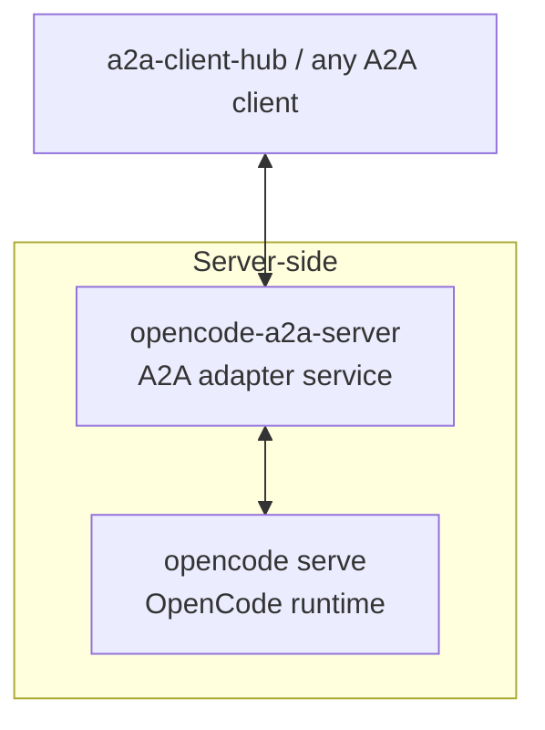

# opencode-a2a-server

> Expose OpenCode through A2A.

`opencode-a2a-server` adds an A2A service layer to `opencode serve`, with
auth, streaming, session continuity, interrupt handling, and a clear
deployment boundary.

## What This Is

- An A2A adapter service for `opencode serve`.
- Use it when you need a stable A2A endpoint for apps, gateways, or A2A
  clients.



## Quick Start

Install with `uv tool`:

```bash
uv tool install opencode-a2a-server
```

Start the service with a bearer token:

```bash
A2A_BEARER_TOKEN=dev-token opencode-a2a-server serve
```

For advanced configuration, two-process setup, and the full environment variable catalog, see [`docs/guide.md`](docs/guide.md).

## What You Get

- A2A HTTP+JSON and JSON-RPC support
- SSE streaming with normalized block types (`text`, `reasoning`, `tool_call`)
- Session continuity and model selection through shared metadata extensions
- [Agent Card](https://github.com/liujuanjuan1984/a2a-spec) discovery and OpenAPI metadata

Detailed protocol contracts and extension docs live in [`docs/guide.md`](docs/guide.md).

## When To Use It

Use this project when you need an A2A adapter for `opencode serve`. It provides a thin service boundary with auth and streaming, but it is **not** a hardened multi-tenant platform.

For mutually untrusted tenants, run separate instance pairs in isolated environments.

## Deployment Boundary

This repository focuses on the service boundary around OpenCode. For detailed security guidance, threat model, and isolation principles, see [SECURITY.md](SECURITY.md).

- `A2A_BEARER_TOKEN` protects the A2A surface.
- One instance pair is a single-tenant trust boundary by design.
- Deployment supervision is BYO (e.g., `systemd`, Docker).

Read [SECURITY.md](SECURITY.md) before production deployment.


## Further Reading

- [docs/guide.md](docs/guide.md)
  Usage guide, transport details, streaming behavior, extensions, and examples.
- [SECURITY.md](SECURITY.md)
  Threat model, deployment caveats, and vulnerability disclosure guidance.

## Development

For contributor workflow, local validation, and helper scripts, see
[CONTRIBUTING.md](CONTRIBUTING.md) and [scripts/README.md](scripts/README.md).

## License

Apache-2.0. See [`LICENSE`](LICENSE).
