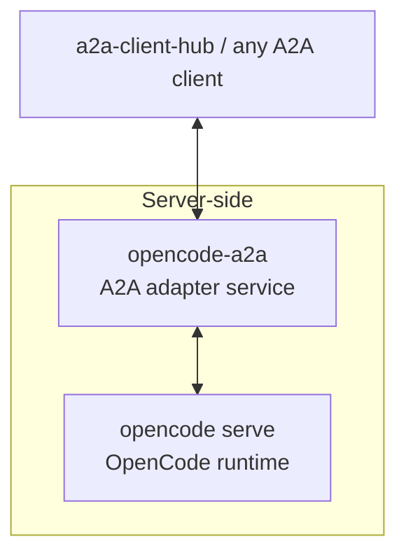

# opencode-a2a

> Expose OpenCode through A2A.

`opencode-a2a` adds an A2A runtime layer to `opencode serve`, with
auth, streaming, session continuity, interrupt handling, and a clear
deployment boundary.

## What This Is

- An A2A adapter service for `opencode serve`.
- Use it when you need a stable A2A endpoint for apps, gateways, or A2A
  clients.



## Quick Start

Install the released CLI with `uv tool`:

```bash
uv tool install opencode-a2a
```

Upgrade later with:

```bash
uv tool upgrade opencode-a2a
```

Make sure provider credentials and a default model are configured on the
OpenCode side, then start OpenCode:

```bash
opencode auth login
opencode models
opencode serve --hostname 127.0.0.1 --port 4096
```

Then start `opencode-a2a` against that upstream:

```bash
A2A_BEARER_TOKEN=dev-token \
OPENCODE_BASE_URL=http://127.0.0.1:4096 \
A2A_HOST=127.0.0.1 \
A2A_PORT=8000 \
A2A_PUBLIC_URL=http://127.0.0.1:8000 \
A2A_STREAM_SSE_PING_SECONDS=15 \
OPENCODE_WORKSPACE_ROOT=/abs/path/to/workspace \
opencode-a2a serve
```

Verify that the service is up:

```bash
curl http://127.0.0.1:8000/.well-known/agent-card.json
```

Default local address: `http://127.0.0.1:8000`

## What You Get

- A2A HTTP+JSON endpoints such as `/v1/message:send` and
  `/v1/message:stream`
- A2A JSON-RPC support on `POST /`
- SSE streaming with normalized `text`, `reasoning`, and `tool_call` blocks
- Explicit REST SSE keepalive configurable through `A2A_STREAM_SSE_PING_SECONDS`
- Session continuity through `metadata.shared.session.id`
- Request-scoped model selection through `metadata.shared.model`
- OpenCode-oriented JSON-RPC extensions for session and model/provider queries

Detailed protocol contracts, examples, and extension docs live in
[`docs/guide.md`](docs/guide.md).

## When To Use It

Use this project when:

- you want to keep OpenCode as the runtime
- you need A2A transports and Agent Card discovery
- you want a thin service boundary instead of building your own adapter

Look elsewhere if:

- you need hard multi-tenant isolation inside one shared runtime
- you want this project to manage your process supervisor or host bootstrap
- you want a general client integration layer rather than a server wrapper

For client-side integration, prefer
[a2a-client-hub](https://github.com/liujuanjuan1984/a2a-client-hub).

## Deployment Boundary

This repository improves the service boundary around OpenCode, but it does not
turn OpenCode into a hardened multi-tenant platform.

- `A2A_BEARER_TOKEN` protects the A2A surface.
- Provider auth and default model configuration remain on the OpenCode side.
- Deployment supervision is intentionally BYO. Use `systemd`, Docker,
  Kubernetes, or another supervisor if you need long-running operation.
- For mutually untrusted tenants, run separate instance pairs with isolated
  users, containers, workspaces, credentials, and ports.

Read before deployment:

- [SECURITY.md](SECURITY.md)
- [docs/guide.md](docs/guide.md)

## Further Reading

- [docs/guide.md](docs/guide.md)
  Usage guide, transport details, streaming behavior, extensions, and examples.
- [SECURITY.md](SECURITY.md)
  Threat model, deployment caveats, and vulnerability disclosure guidance.

## Development

For contributor workflow, local validation, and helper scripts, see
[CONTRIBUTING.md](CONTRIBUTING.md) and [scripts/README.md](scripts/README.md).

## License

Apache-2.0. See [`LICENSE`](LICENSE).
