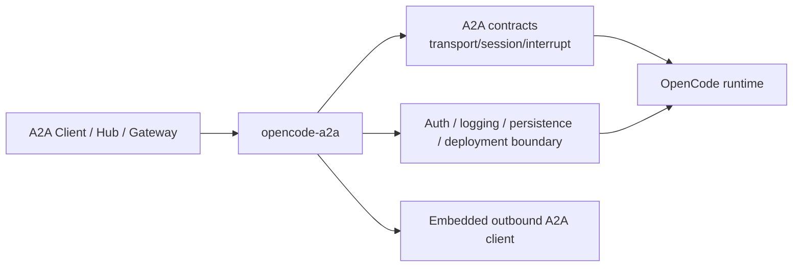

# Architecture Guide

This document explains what `opencode-a2a` is responsible for, what remains inside OpenCode, and how requests move through the adapter boundary.

## System Role

`opencode-a2a` is an adapter layer between A2A clients and an OpenCode runtime.

It is responsible for:

- exposing A2A-facing HTTP+JSON and JSON-RPC endpoints
- normalizing transport, streaming, session, and interrupt contracts
- applying authentication, logging, persistence, and deployment-side guardrails
- hosting an outbound A2A client for peer calls triggered by CLI usage or `a2a_call`

It is not responsible for:

- replacing OpenCode's own provider or model selection internals
- hard multi-tenant isolation inside one shared deployment by default
- acting as a general OpenCode process supervisor

## Adapter Layers

This view emphasizes service responsibility boundaries rather than internal module structure. The root [README](../README.md) keeps the overview path for first-time readers, while [maintainer-architecture.md](./maintainer-architecture.md) covers module boundaries and request call chains for contributors.

## Request Flow

### Standard send/stream flow

1. A client calls the REST or JSON-RPC endpoint.
2. FastAPI middleware validates auth, request size, protocol version, and logging policy.
3. The adapter maps transport payloads into the OpenCode-facing execution path.
4. The execution layer calls the upstream OpenCode runtime and consumes its stream or unary response.
5. The service maps the result back into shared A2A-facing task, message, and stream event contracts.

### Streaming flow

For streaming requests, the adapter does more than simple passthrough:

- classifies stream blocks into shared types such as `text`, `reasoning`, and `tool_call`
- preserves stable event and message identity where possible
- emits shared interrupt lifecycle state
- avoids duplicate final snapshots when streaming already produced the final text

Detailed streaming contract: [Usage Guide](guide.md)

### Session flow

The service keeps a shared session continuation contract around `metadata.shared.session.id` and adapter-derived `contextId`, so clients can continue work without binding directly to raw OpenCode session IDs.

### Outbound peer flow

The same process can also act as an embedded A2A client:

- CLI calls route through the local client facade
- server-side `a2a_call` tool execution uses the same outbound client settings
- outbound auth, timeouts, and transport preferences are configured independently from inbound auth

## Boundary Model

The adapter improves the runtime boundary, but it is not a full trust-boundary replacement.

### What the adapter boundary helps with

- stable A2A-facing contract shape
- auth enforcement on A2A entrypoints
- payload logging controls
- lightweight persistence for SDK task rows plus adapter-managed runtime state
- compatibility metadata for clients and operators

### What still belongs to the OpenCode runtime boundary

- provider credential consumption
- workspace side effects
- upstream model/provider behavior
- host-level process supervision and isolation

That is why deployments should still be treated as trusted or controlled unless stronger isolation is added outside this repository.

## Documentation Split

Use the docs by responsibility:

- [README](../README.md): project overview, install/start path, and entry navigation
- [Usage Guide](guide.md): runtime configuration, transport contracts, extensions, and examples
- [Maintainer Architecture Guide](maintainer-architecture.md): internal module boundaries, request call chains, and persistence touchpoints
- [Extension Specifications](extension-specifications.md): stable extension URI/spec index and disclosure policy
- [Conformance Notes](conformance.md): external TCK experiment workflow
- [Contributing Guide](../CONTRIBUTING.md): contributor workflow and validation
- [Security Policy](../SECURITY.md): threat model and disclosure guidance
