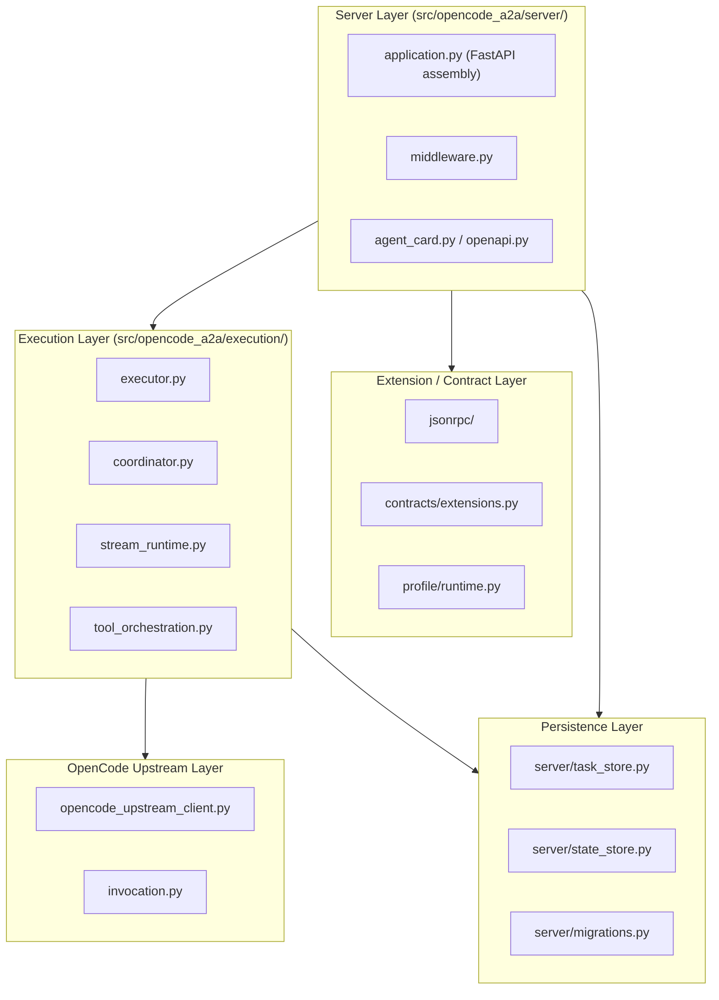

# Maintainer Architecture Guide

This document describes the internal structure, module boundaries, and main request call chains of `opencode-a2a`. It is intended for maintainers and contributors. Use [architecture.md](./architecture.md) for the higher-level service boundary view and [guide.md](./guide.md) for deployment-facing runtime configuration.

## Core Component Map

## Request Call Chain

### Inbound Message Send / Stream

1. `server/application.py` assembles the FastAPI app, SDK adapters, and middleware stack.
2. `server/middleware.py` handles auth, request sizing, protocol negotiation, logging, and response headers.
3. The SDK-backed handler delegates execution to `execution/executor.py`.
4. The execution layer coordinates session continuity, stream handling, tool calls, and error translation through:
   - `execution/coordinator.py`
   - `execution/stream_runtime.py`
   - `execution/tool_orchestration.py`
5. `opencode_upstream_client.py` sends requests to the upstream OpenCode runtime.
6. The adapter maps upstream responses back into A2A tasks, messages, artifacts, and stream events.

### JSON-RPC Extension Path

1. `jsonrpc/application.py` owns the adapter-specific JSON-RPC application boundary.
2. `jsonrpc/dispatch.py` and handler modules under `jsonrpc/handlers/` route provider-private methods.
3. `contracts/extensions.py` remains the SSOT for extension metadata exposed through Agent Card and OpenAPI.
4. Tests under `tests/contracts/` and `tests/jsonrpc/` guard contract drift.

### Outbound Peer Call Path

1. CLI or server-side tool execution asks `server/client_manager.py` for an outbound client.
2. `client/` builds and configures the embedded A2A client facade.
3. Outbound peer responses are normalized before being reintroduced into the local runtime surface.

## Module Responsibilities

### Server Layer

- `server/application.py`: app assembly, route wiring, request handler customization, and top-level lifecycle integration
- `server/middleware.py`: auth, protocol negotiation, payload/body guards, logging, and response decoration
- `server/agent_card.py` / `server/openapi.py`: machine-readable contract publication
- `server/rest_tasks.py`: SDK-owned REST task routes plus adapter-specific list behavior

### Execution Layer

- `execution/executor.py`: main orchestration entrypoint
- `execution/coordinator.py`: OpenCode session coordination and request shaping
- `execution/stream_runtime.py` / `execution/stream_events.py`: stream normalization and event conversion
- `execution/tool_orchestration.py`: embedded peer-call tool handling
- `execution/upstream_error_translator.py` / `execution/tool_error_mapping.py`: upstream-facing error normalization

### Extension and Contract Layer

- `contracts/extensions.py`: SSOT for extension metadata, compatibility profile, and wire-contract payloads
- `jsonrpc/`: provider-private JSON-RPC extension surface
- `profile/runtime.py`: runtime profile that feeds Agent Card, OpenAPI, and compatibility metadata
- `protocol_versions.py`: protocol normalization and negotiation helpers

### Persistence Layer

- `server/task_store.py`: SDK task store construction plus adapter policy wrappers
- `server/state_store.py`: session binding and interrupt repositories
- `server/migrations.py`: adapter-managed state schema migrations

### Client Layer

- `client/`: outbound peer card discovery, request context, auth handling, polling fallback, and error mapping

## Key Persistence Points

- SDK task rows stored through the configured task store backend
- adapter-managed session binding / ownership state
- interrupt request bindings and tombstones
- pending preferred-session claims

The custom migration runner owns only adapter-managed state tables; SDK-managed task schema still follows the SDK path.

## Configuration Layering

Configuration is handled in [config.py](../src/opencode_a2a/config.py) with `pydantic-settings`.

- `A2A_*`: inbound runtime, outbound peer client, protocol, persistence, and deployment metadata
- `OPENCODE_*`: upstream OpenCode connection and request behavior

## Practical Reading Order

For maintainers new to the codebase, this order usually gives the fastest payoff:

1. `README.md`
2. `docs/architecture.md`
3. `src/opencode_a2a/server/application.py`
4. `src/opencode_a2a/execution/executor.py`
5. `src/opencode_a2a/contracts/extensions.py`
6. `docs/guide.md`
